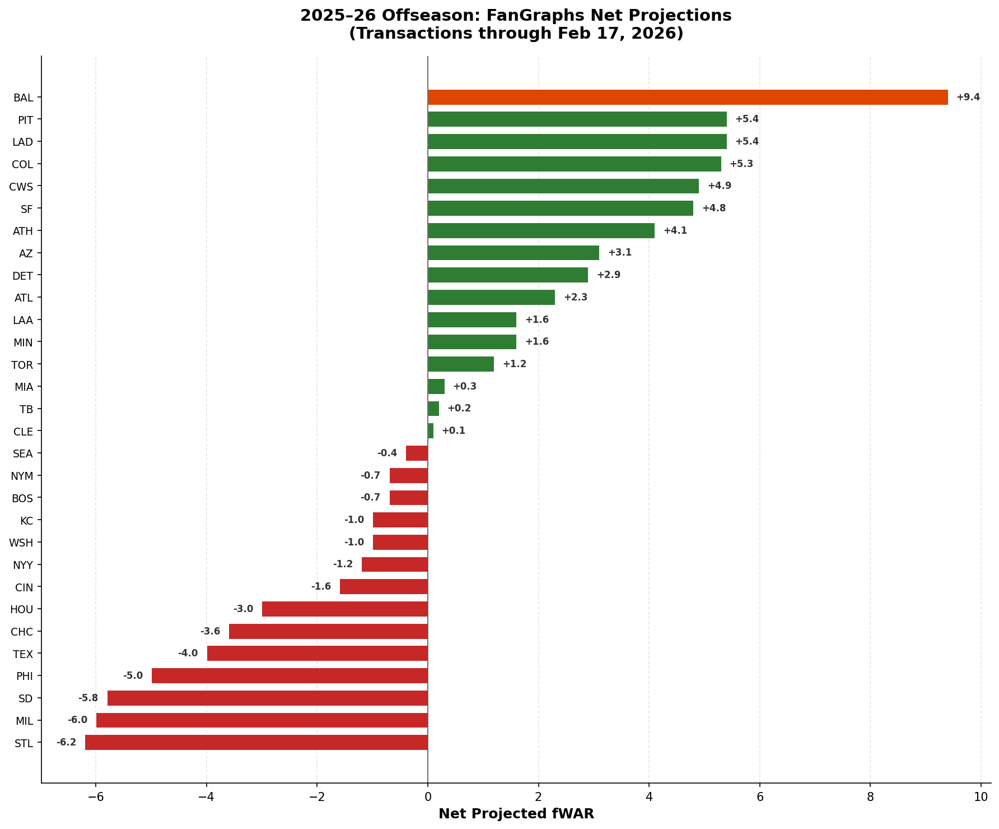

# 2025-26 Offseason fWAR Analysis

**Date:** February 17, 2026
**Source:** FanGraphs offseason transaction tracker (through Feb 17, 2026)

## Overview

This analysis computes the net projected fWAR change for each of the 30 MLB teams based on offseason player movement — free agent signings, trades, waiver claims, non-tenders, option decisions, releases, and outrights.

## Methodology

### Data Sources

Two pre-categorized FanGraphs exports were used:

- **`fwar-additions.csv`** (652 rows) — all player additions per team (FA signings, trades acquired, waiver claims, minor league contracts)
- **`fwar-subtractions.csv`** (266 rows) — all player departures per team (non-tenders, releases, option declines, opt-outs, outrights, free agency departures)

### WAR Metric

All values use FanGraphs **Proj. WAR** (2026 ZiPS/Steamer projection), not backward-looking 2025 actual WAR. Missing projections are treated as 0 (mostly fringe/MiLB players).

### Trade Departure Extraction

The FanGraphs subtractions export does **not** include players lost via trade — trades are only recorded from the acquiring team's perspective in the additions file. To account for trade departures, the script parses trade descriptions (e.g., `"Acquired from Orioles for OF Taylor Ward"`) and creates synthetic subtraction entries for the team that lost each player. This extracted **165 trade departures** from the additions file.

### What Is NOT Counted

The following are excluded from net fWAR calculations:

- **Arbitration signings** — players re-signing with their existing team via arbitration are internal re-signings, not new additions
- **Club/player option exercises** — retaining an existing player is not a new gain
- **Contract extensions** — player was already on the team
- **Contract selections from minors** — internal promotions

### Known Data Gaps

The FanGraphs export is **incomplete** for certain transaction types:

- **Roki Sasaki** (LAD) — NPB posting, not in the FanGraphs transaction tracker
- Other international signings may be missing

Note: Corbin Burnes and Blake Snell are absent due to injury and are correctly excluded. Willy Adames and Teoscar Hernandez are under existing multi-year contracts and were not free agents this offseason.

These gaps mean the totals for some teams (notably LAD) are understated.

## Results

### FanGraphs Net Projections

| Rank | Team | Division | Adds | Subs | Gained | Lost | Net fWAR |
|------|------|----------|------|------|--------|------|----------|
| 1 | BAL | AL East | 22 | 15 | 13.0 | 3.6 | **+9.4** |
| 2 | PIT | NL Central | 19 | 11 | 7.0 | 1.6 | **+5.4** |
| 3 | LAD | NL West | 16 | 10 | 6.6 | 1.2 | **+5.4** |
| 4 | COL | NL West | 23 | 13 | 6.7 | 1.4 | **+5.3** |
| 5 | CWS | AL Central | 25 | 17 | 7.7 | 2.8 | **+4.9** |
| 6 | SF | NL West | 20 | 9 | 7.3 | 2.5 | **+4.8** |
| 7 | ATH | AL West | 21 | 9 | 5.3 | 1.2 | **+4.1** |
| 8 | AZ | NL West | 23 | 10 | 5.2 | 2.1 | **+3.1** |
| 9 | DET | AL Central | 15 | 12 | 5.9 | 3.0 | **+2.9** |
| 10 | ATL | NL East | 26 | 17 | 5.4 | 3.1 | **+2.3** |
| 11 | LAA | AL West | 23 | 13 | 6.3 | 4.7 | **+1.6** |
| 12 | MIN | AL Central | 22 | 18 | 3.7 | 2.1 | **+1.6** |
| 13 | TOR | AL East | 19 | 13 | 10.3 | 9.1 | **+1.2** |
| 14 | MIA | NL East | 23 | 13 | 3.8 | 3.5 | **+0.3** |
| 15 | TB | AL East | 30 | 23 | 8.6 | 8.4 | **+0.2** |
| 16 | CLE | AL Central | 9 | 6 | 0.4 | 0.3 | **+0.1** |
| 17 | SEA | AL West | 22 | 16 | 4.8 | 5.2 | **-0.4** |
| 18 | NYM | NL East | 34 | 23 | 16.9 | 17.6 | **-0.7** |
| 19 | BOS | AL East | 32 | 31 | 13.0 | 13.7 | **-0.7** |
| 20 | KC | AL Central | 19 | 13 | 3.3 | 4.3 | **-1.0** |
| 21 | WSH | NL East | 28 | 13 | 3.9 | 4.9 | **-1.0** |
| 22 | NYY | AL East | 25 | 16 | 1.2 | 2.4 | **-1.2** |
| 23 | CIN | NL Central | 15 | 12 | 3.4 | 5.0 | **-1.6** |
| 24 | HOU | AL West | 19 | 14 | 4.9 | 7.9 | **-3.0** |
| 25 | CHC | NL Central | 21 | 17 | 7.8 | 11.4 | **-3.6** |
| 26 | TEX | AL West | 22 | 24 | 8.4 | 12.4 | **-4.0** |
| 27 | PHI | NL East | 20 | 12 | 2.0 | 7.0 | **-5.0** |
| 28 | SD | NL West | 22 | 10 | 2.9 | 8.7 | **-5.8** |
| 29 | MIL | NL Central | 17 | 13 | 4.2 | 10.2 | **-6.0** |
| 30 | STL | NL Central | 20 | 8 | 2.8 | 9.0 | **-6.2** |

### Baltimore Orioles Breakdown

**Net: +9.4 Proj. fWAR** (13.0 gained, 3.6 lost)

Key additions:
| Player | Proj. fWAR | Transaction |
|--------|-----------|-------------|
| Pete Alonso | 3.6 | 5-year FA signing |
| Taylor Ward | 2.7 | Trade (from LAA for Grayson Rodriguez) |
| Chris Bassitt | 1.9 | 1-year FA signing |
| Shane Baz | 1.8 | Trade (from TB) |
| Ryan Helsley | 1.1 | 2-year FA signing |
| Blaze Alexander | 1.0 | Trade (from AZ) |
| Andrew Kittredge | 0.6 | Trade (from CHC) |
| Leody Taveras | 0.3 | 1-year FA signing |
| Dietrich Enns | 0.3 | 1-year FA signing |

Key losses:
| Player | Proj. fWAR | Transaction |
|--------|-----------|-------------|
| Grayson Rodriguez | 2.1 | Traded to LAA |
| Tomoyuki Sugano | 0.8 | Free agent (signed with COL) |
| Gary Sanchez | 0.5 | Free agent (signed with MIL) |
| Jorge Mateo | 0.2 | Club option declined |

## Files

| File | Description |
|------|-------------|
| `fwar-additions.csv` | Raw FanGraphs additions export (652 transactions) |
| `fwar-subtractions.csv` | Raw FanGraphs subtractions export (266 transactions) |
| `fangraphs_net_fwar.py` | Analysis script — parses both files, extracts trade departures, computes net fWAR, generates chart |
| `fangraphs-net-fwar-summary.csv` | Per-team summary (30 rows) |
| `fangraphs-net-fwar-chart.png` | Horizontal bar chart of net projected fWAR |

## Caveats

1. **Incomplete data** — Roki Sasaki (LAD, NPB posting) is missing from the FanGraphs export. LAD's actual gains are understated. Burnes and Snell are absent due to injury (correctly excluded). Adames and Teoscar are under existing contracts (correctly excluded).
2. **Projection uncertainty** — Proj. WAR values are ZiPS/Steamer projections, not certainties. Actual 2026 performance will vary.
3. **Minor league signings** — Players signed to MiLB contracts with Proj. WAR of 0 are counted but contribute nothing to the total. Their upside is not captured.
4. **Trade prospect value** — When a team trades for an established player by sending prospects, the prospects' projected WAR may be 0 or very low (no MLB track record), understating the true cost to the trading team.
5. **Mid-offseason snapshot** — This data is as of Feb 17, 2026. Spring training signings and trades after this date are not included.
